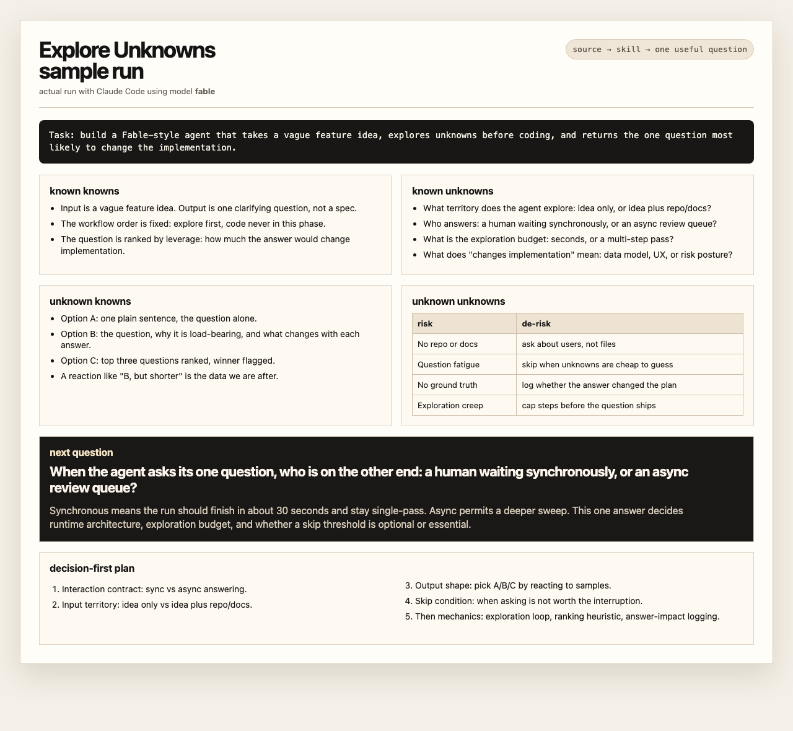

# Superflux Labs

Small, runnable agent skills, proof artifacts, and runbooks for agent workflows that finish with evidence.

This repo has two public lanes:

- **Skills and proof artifacts** — portable agent skills with validation, source credit, and sample-run proof.
- **Agent runbooks** — operating procedures for repeatable agent workflows: coding loops, review loops, documentation loops, research loops, and the safety rails that keep them from drifting forever.

## Public labs

### `explore-unknowns`

A portable skill based on Thariq Shihipar's public Fable article, “A Field Guide to Fable: Finding Your Unknowns.”

It turns ambiguous or long-horizon agent work into a four-quadrant unknowns map before the agent starts guessing:

- known knowns;
- known unknowns;
- unknown knowns;
- unknown unknowns;
- decision-first plan;
- implementation notes;
- sample-run proof and merge quiz.

#### Install / smoke-test locally

```bash
npm install
npm run validate
```

#### Install into Claude Code + Codex with the Skills CLI

```bash
npx -y skills add . --skill explore-unknowns --agent claude-code codex --copy -y --full-depth
```

Expected locations:

- `.claude/skills/explore-unknowns/`
- `.agents/skills/explore-unknowns/`

#### Install into Hermes Agent for local testing

```bash
TMP_HERMES=$(mktemp -d)
mkdir -p "$TMP_HERMES/skills"
cp -R skills/explore-unknowns "$TMP_HERMES/skills/explore-unknowns"
HERMES_HOME="$TMP_HERMES" hermes skills list | grep -i explore-unknowns
```

#### Proof

See [`content/proof/explore-unknowns/2026-07-06-sample-run.md`](content/proof/explore-unknowns/2026-07-06-sample-run.md).



### Agent runbooks

AI agents do not need more prompt dumps. They need operating procedures.

A prompt says, “ask the model this.” A runbook says:

- when to use the workflow;
- what should be true at the end;
- how to verify the result;
- when to stop;
- how the workflow usually fails;
- who deserves credit if the workflow adapts someone else's public idea.

That difference matters. Teams are already handing real repos, docs, tickets, CI, customer research, and business workflows to agents. The failure mode is rarely “the prompt was ugly.” It is usually one of these:

- the agent never reproduced the bug;
- the agent shipped code without real verification;
- the agent looped because “improve this” had no stop condition;
- the agent copied a public idea without credit;
- the human got a confident summary instead of evidence.

Runbooks make the boundary explicit.

#### Current runbooks

- [Architecture Satisfaction Loop](runbooks/architecture-satisfaction-loop.md)
- [Bug Reproduction Loop](runbooks/bug-reproduction-loop.md)

#### What belongs in a runbook

A good agent runbook is small enough to use and strict enough to trust.

Each runbook should include:

1. **Use when** — the exact trigger.
2. **Outcome** — what should be true when the loop is done.
3. **Workflow** — the prompts, commands, checks, or agent instructions.
4. **Verification** — tests, live checks, review steps, artifacts, or receipts.
5. **Stop condition** — the rule that prevents endless agent motion.
6. **Failure modes** — how the workflow goes wrong and how to bound the damage.
7. **Example** — a minimal realistic case.
8. **Source / credit** — public links and acknowledgements for adapted ideas.

Runbooks can include prompts. They are not prompt libraries.

#### First five runbooks planned

These are the first five runbooks this project should grow toward.

1. **Architecture Satisfaction Loop** — repeated architecture critique and refinement, with a hard stop so “until happy” does not become infinite refactor drift.
2. **Bug Reproduction Loop** — reproduce the bug, isolate it, write or update a failing test, fix, and verify.
3. **PR Babysitter Loop** — watch CI, summarize failures, rebase when safe, fix clear flakes, and stop on permission gates.
4. **Docs Sweep Loop** — keep documentation honest by checking commands, paths, examples, and stale claims.
5. **Revenue Research Loop** — turn messy market/source research into a bounded evidence packet with a clear “what to do next” section.

## Publication safety

This repository is meant to be public. That means every change should pass two gates:

1. **Content gate** — no private context, private paths, credentials, or internal operating notes.
2. **Evidence gate** — every skill, proof artifact, or runbook needs verification steps and stop conditions.

The CI workflow runs a repository scan on pull requests, pushes, and a recurring schedule. It looks for high-confidence private terms, local machine paths, secret-looking strings, and accidental internal artifact references.

The scan is a guardrail, not a replacement for human review.

## How to contribute a runbook

1. Start with a workflow that you have actually used or can explain concretely.
2. Write the trigger and expected outcome first.
3. Add verification before adding clever prompts.
4. Add a stop condition.
5. Name the failure modes.
6. Credit public sources.
7. Keep private context out.

If you are not sure whether something belongs in public, leave it out and link to a generic pattern instead.

## Builder CTA

If this helps, star or watch the repo.

If you have a workflow pain that agents keep mishandling, open an issue or suggest a runbook.

The best contributions are not shiny prompts. They are repeatable loops that leave evidence.

## Source and credit

The `explore-unknowns` package is a source-grounded skill package, not an article mirror. It credits the public source, preserves short excerpts in a ledger, and converts the idea into a runnable agent workflow. It does not imply endorsement from Thariq, Anthropic, David/dzhng, or Fable.

The first seed for Agent Runbooks came from public discussion around Peter Steinberger's Architecture Satisfaction Loop, including Loop Library's [Architecture Refactoring Loop for Coding Agents](https://signals.forwardfuture.com/loop-library/loops/architecture-satisfaction-loop/), and the broader idea of repeatable agent loops.

Good credit makes the corpus better. It lets builders trace where ideas came from, compare variants, and improve the workflow without pretending it appeared from nowhere.
